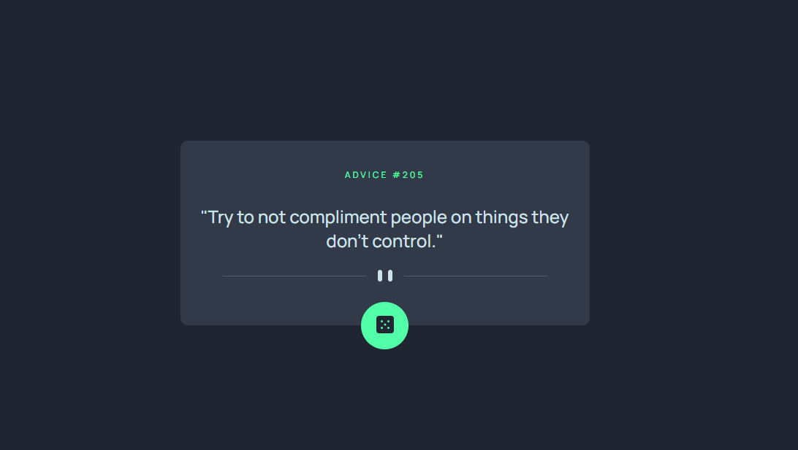

# Advice Split

Site que exibe conselhos aleatórios por meio do consumo de uma API REST, com atualização dinâmica do conteúdo e interface responsiva desenvolvida em React.
Esse é uma atividade do Frontend Mentors.

 

## 🚀 Tecnologias utilizadas

* HTML 5
* CSS 3
* JavaScript
* Vite
* React

 

## 🎯 Funcionalidades

* [ ] Consumo de API REST

 

## 📸 Preview

 

## 👤 Como interagir com o projeto

Acesse o [Link](https://advice-split.vercel.app/)

 

## 🧠 Aprendizados

* Mobile first
* Trabalhar com estado no React
* Manipulação de DOM
* Consumo de API
* Organização de código

 

## 🙋‍♀️ Autora

Feito por Andressa Tomiozzo 💙
[LinkedIn](https://www.linkedin.com/in/andressa-tomiozzo/)